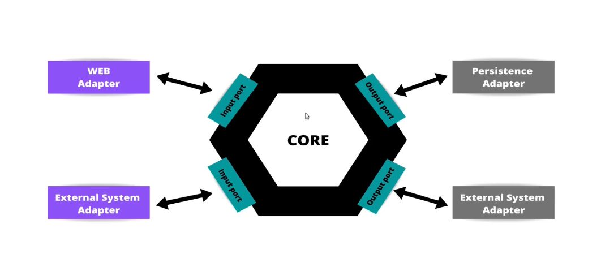
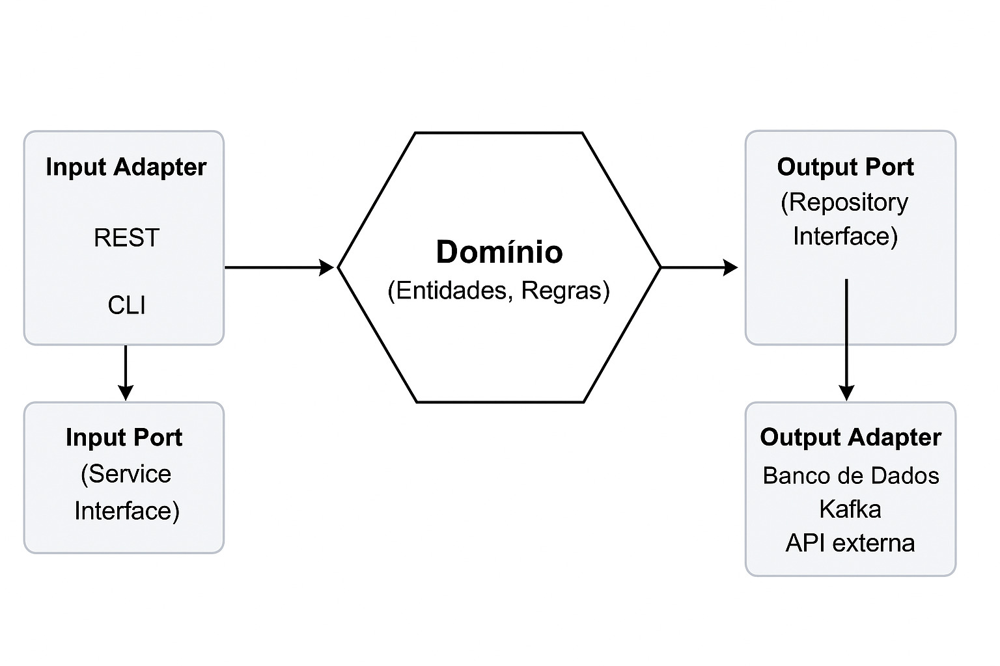
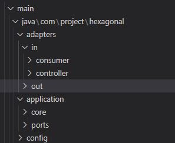
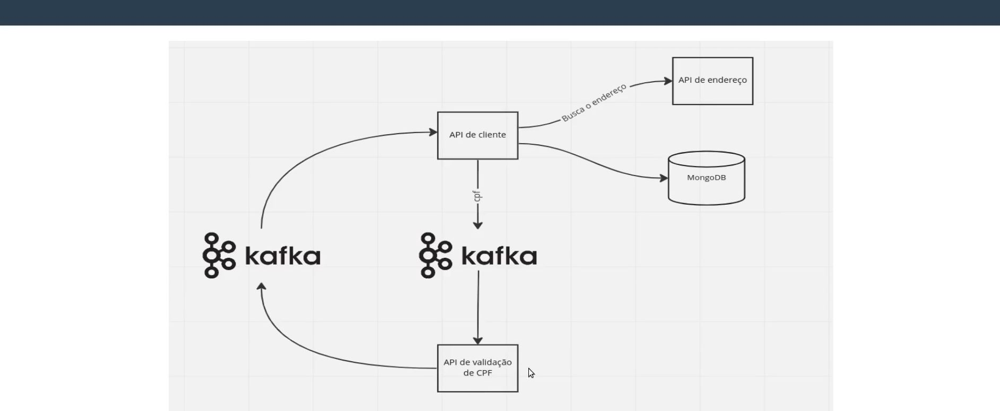
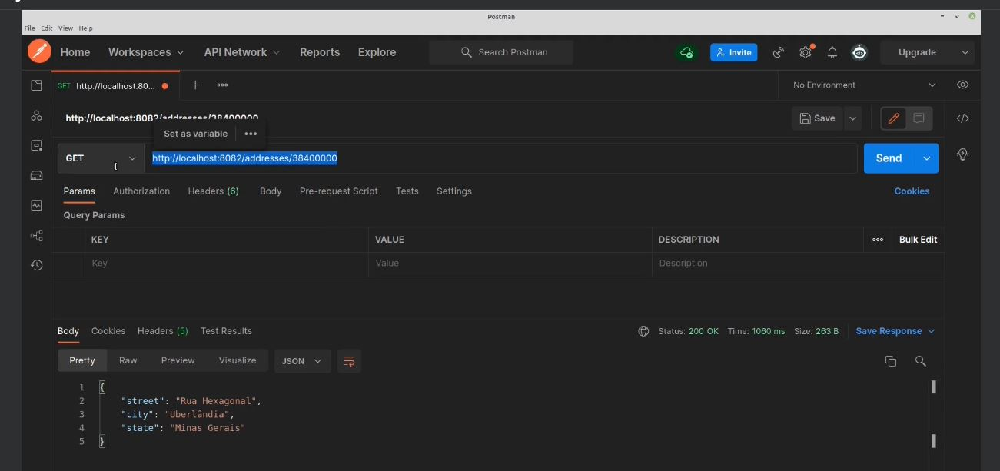
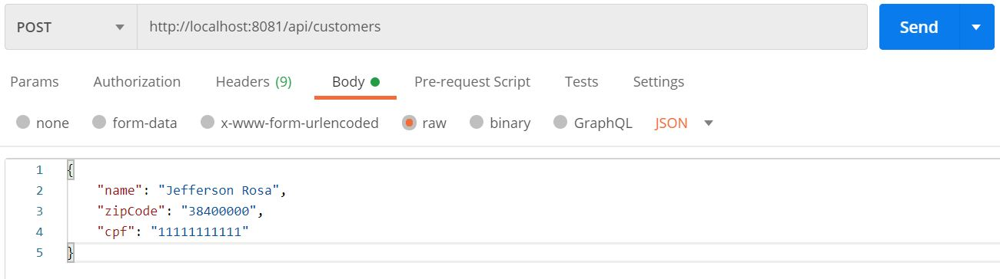

# Introdução à Arquitetura Hexagonal

---

## 1. Microsserviços e Arquitetura Hexagonal

Em muitos sistemas tradicionais, as regras de negócio estão fortemente dependentes da infraestrutura, dificultando manutenção e evolução.

Nos últimos anos, a arquitetura de microsserviços tem ganhado destaque como uma abordagem para construir sistemas distribuídos e escaláveis.

Microsserviços são pequenos serviços independentes, cada um responsável por uma funcionalidade específica, que se comunicam entre si por APIs bem definidas, por exemplo.

Embora os microsserviços tragam muitos benefícios, como escalabilidade, deploy independente e isolamento de falhas, eles também impõem desafios, como complexidade na comunicação, orquestração e consistência de dados.

Para minimizar esses desafios e garantir sistemas modulares, testáveis e fáceis de manter, a **Arquitetura Hexagonal** é uma escolha interessante para a construção dos microsserviços, pois  separa claramente o domínio das implementações técnicas, facilitando mudanças e testes isolados.

#### 1.1 Introdução à Arquitetura Hexagonal

A **Arquitetura Hexagonal** — também chamada de Ports and Adapters — foi proposta por Alistair Cockburn nos anos 90 para solucionar um problema clássico: o acoplamento excessivo da lógica de negócio às tecnologias externas. O objetivo principal é garantir que o núcleo do sistema, ou domínio, fique totalmente isolado e independente da infraestrutura, facilitando manutenção, testes e evolução do sistema.

Os objetivos de uma Arquitetura Hexagonal são parecidos com os de uma Arquitetura Limpa.

A ideia é construir sistemas que favorecem reusabilidade de código, alta coesão (cada componente/módulo tem responsabilidades bem definidas e relacionadas), baixo acoplamento(os componentes dependem o mínimo possível uns dos outros), independência de tecnologia, mais fáceis de serem testados, facilitando a manutenção e evolução do sistema:

- Separar a lógica de negócio da infraestrutura e interfaces.
- Facilitar a substituição ou evolução de tecnologias sem impactar o domínio.
- Garantir alta coesão e baixo acoplamento, essenciais em sistemas distribuídos.

**Uma Arquitetura Hexagonal divide as classes de um sistema em dois grupos principais:**

* Classes de domínio, isto é, diretamente relacionadas com o negócio do sistema.
* Classes relacionadas com infraestrutura, tecnologias e responsáveis pela integração com sistemas externos (ex: bancos de dados).

Além disso, em uma Arquitetura Hexagonal, **classes de domínio não devem depender de classes relacionadas com infraestrutura, tecnologias ou sistemas externos.**

A vantagem dessa divisão é desacoplar esses dois tipos de classes.

Assim, as classes de domínio não conhecem as tecnologias – bancos de dados, interfaces com usuário e quaisquer outras bibliotecas – usadas pelo sistema.

Consequentemente, mudanças de tecnologia podem ser feitas sem impactar as classes de domínio.

Talvez ainda mais importante, as classes de domínio podem ser compartilhadas por mais de uma tecnologia. Por exemplo, um sistema pode ter diversas interfaces (Web, mobile, etc).

Visualmente, a arquitetura é representada por meio de dois hexágonos concêntricos.



- Hexágono Interno: Domínio (entidades, regras)
- Hexágono Externo: Adaptadores (infraestrutura, tecnologia)
- Fora do hexágono: Interfaces com usuário, sistemas externos

#### 1.2 Conceitos-chave da Arquitetura Hexagonal

- **Domínio central independente:** No coração da arquitetura está a lógica de negócio (domínio), que deve estar completamente isolada das implementações externas.

- **Ports (Portas):** São interfaces que definem pontos de entrada e saída para a aplicação. Por exemplo, uma interface para salvar ou buscar dados.

- **Adapters (Adaptadores):** São implementações concretas dessas interfaces que interagem com o mundo externo — como um adaptador de banco de dados, uma API REST, um sistema de mensagens, etc.

- **Comunicação unidirecional:** Os adaptadores dependem apenas das portas, e o domínio não depende de nenhuma tecnologia específica.

- **Flexibilidade:** A aplicação pode trocar adaptadores sem modificar a lógica de negócio, facilitando a manutenção e evolução.

- **Testabilidade:** A separação clara permite a criação de testes unitários isolados da infraestrutura.


#### 1.3 Vantagens da Arquitetura Hexagonal

- **Baixo acoplamento:** Permite mudanças isoladas em bancos de dados, interfaces ou protocolos sem impacto na lógica.

- **Alta testabilidade:** Pode-se testar o domínio sem precisar de banco, rede ou UI.

- **Facilidade de evolução:** Adaptadores podem ser trocados ou expandidos sem reescrever regras.

- **Organização clara:** Torna explícito o papel de cada componente.

#### 1.4 Desvantagens e desafios

- **Curva de aprendizado:** Para equipes não familiarizadas, pode parecer mais complexo inicialmente.

- **Overhead inicial:** Requer mais planejamento e disciplina para definir bem as interfaces e separações.

- **Possível aumento de camadas:** Pode parecer excessivo para aplicações muito simples.

---

## 2. Estrutura do Projeto e Conceito de Ports e Adapters

A arquitetura hexagonal se baseia fortemente no conceito de **Ports** e **Adapters**, que são responsáveis por separar o núcleo do sistema (domínio) das tecnologias externas e interfaces.

### 2.1 O que são Ports e Adapters?




- **Ports (Portas):** São interfaces que definem os pontos de comunicação entre o domínio e o mundo externo, ou seja, uma porta é responsável por intermediar a comunicação com as classes de domínio.Divididas em:

    - **Input Ports (Portas de Entrada):**  
      São interfaces usadas para comunicação de fora para dentro, isto é, quando uma classe externa precisa chamar um método de uma classe de domínio. Logo, essas portas declaram os serviços providos pelo sistema, isto é, serviços que o sistema oferece para o mundo exterior.
      Elas definem as operações ou casos de uso que o sistema oferece para o mundo externo, como serviços que recebem requisições para executar regras de negócio.  
      *Exemplo:* interface que descreve o serviço para criar ou listar produtos.

    - **Output Ports (Portas de Saída):**  
      São interfaces usadas para comunicação de dentro para fora, isto é, quando uma classe de domínio precisa chamar um método de uma classe externa. Logo, essas portas declaram os serviços requeridos pelo sistema, isto é, serviços do mundo exterior que são necessários para o funcionamento do sistema.
      Elas definem as operações que o domínio necessita para persistência, comunicação ou acesso a sistemas externos.  
      *Exemplo:* interface de repositório para salvar ou recuperar produtos do banco.


- **Adapters (Adaptadores):** São as implementações concretas dessas interfaces, que adaptam o domínio às tecnologias específicas.
  Os adaptadores ou adapters possuem a mesma definição de adaptadores de uma arquitetura limpa, isto é, fornecem uma ponte entre o mundo exterior e o mundo interior.

    - **Input Adapters:** Exposição dos ports de entrada, por exemplo, controladores REST, filas que recebem comandos, interfaces gráficas.

    - **Output Adapters:** Implementações dos ports de saída, como repositórios JPA, MongoDB, produtores Kafka, chamadas a APIs externas.


---
## 3. Tecnologias Utilizadas no Projeto Exemplo

Este projeto foi desenvolvido usando o seguinte stack tecnológico:

| Tecnologia       | Descrição                                          |
|------------------|---------------------------------------------------|
| **Java**         | Linguagem principal para desenvolvimento          |
| **Spring Boot**  | Framework para construção da aplicação backend     |
| **MongoDB**      | Banco de dados NoSQL para persistência dos dados  |
| **Kafka**        | Sistema de mensageria para comunicação assíncrona |
| **Docker**       | Containerização para facilitar ambiente de execução|
| **Wiremock**     | Simulação de APIs externas para testes e desenvolvimento|
| **ArchUnit**     | Biblioteca para validar arquitetura do código     |

---

## 4. Estrutura Geral e Fluxo do Sistema

### 4.1 Organização da Arquitetura Hexagonal

O sistema é organizado em duas grandes camadas:

- **Domínio:** Contém as classes relacionadas ao negócio, sem dependência de tecnologia.
- **Infraestrutura:** Contém as implementações que interagem com sistemas externos (bancos, APIs, mensageria).




### 4.2 Descrição do Fluxo de Dados

1. **API de Cliente:**  
   Recebe requisições para criação/consulta de clientes.

2. **Consulta de Endereço via CEP:**  
   Para obter o endereço do cliente pelo CEP, o sistema consulta uma API de endereço externa — que, neste projeto, é simulada com **Wiremock**.

3. **Validação de CPF:**  
   Uma API (também simulada ou real) valida a autenticidade do CPF do cliente.

4. **Persistência dos Dados:**  
   Os dados validados são armazenados no banco **MongoDB**.

5. **Envio de Mensagens:**  
   Sempre que um cliente é criado, um evento é publicado em um tópico **Kafka**, permitindo integração com outros sistemas.



### 4.3 Componentes Externos Mocados com Wiremock

- Para desenvolvimento e testes, as APIs externas (endereço e CPF) são simuladas com o Wiremock, evitando dependências externas reais.

- Arquivos de mapeamento (mappings) são usados para definir as respostas que o Wiremock deve retornar para certas requisições.

---

## 5. Configuração e Execução do Projeto

### 5.1 Preparando o Ambiente

1. **Java e Maven:**  
   Certifique-se que tenha Java 17+ e Maven 3.8+ instalados.

2. **Docker:**  
   Usado para rodar MongoDB, Kafka e Zookeeper.

3. **Wiremock:**  
   Baixe o Wiremock standalone jar:

   [Wiremock Standalone](http://wiremock.org/docs/running-standalone/)

   Extraia no diretório do projeto.

### 5.2 Iniciando o Wiremock

- No terminal, dentro da pasta do Wiremock:

```
bash
java -jar wiremock-standalone-3.4.2.jar --port 8082
```
Isso criará um diretório chamado mappings com os arquivos JSON que definem os endpoints simulados.

### 5.3 Arquivos de Mapeamento Exemplo

**Arquivo: address.json**
 ```{
    "request": {
        "method": "GET",
        "url": "/addresses/38400000"
    },
    "response": {
        "status": 200,
        "headers": {
            "Content-Type": "application/json"
        },
        "jsonBody": {
            "street": "Rua Hexagonal",
            "city": "Uberlândia",
            "state": "Minas Gerais"
        }
    }
}
```
**Arquivo: address_2.json**

``` {
    "request": {
        "method": "GET",
        "url": "/addresses/38400001"
    },
    "response": {
        "status": 200,
        "headers": {
            "Content-Type": "application/json"
        },
        "jsonBody": {
            "street": "Rua das Flores",
            "city": "São Paulo",
            "state": "São Paulo"
        }
    }
}
```

### 5.4 Rodando os Containers com Docker Compose
- O projeto inclui um arquivo docker-compose.yml para subir os serviços necessários:
```
bash
docker-compose up -d
````

Isso iniciará:

- MongoDB

- Kafka

- Zookeeper

### 5.5 Executando a Aplicação Spring Boot
No diretório raiz do projeto, execute:
```
bash
mvn spring-boot:run
```

A aplicação irá rodar na porta 8081 (configuração padrão).

---

## 6. Testando a Aplicação

### 6.1 Testando a API de Clientes
Use o Postman, curl ou outro cliente HTTP para testar.

Exemplo: Criar um cliente

> POST http://localhost:8081/api/customers

- Payload JSON:
 ```
json

{
  "name": "João Silva",
  "cpf": "12345678900",
  "cep": "38400000"
}
```

### 6.2 Consultando Endereços Mocados

Teste no navegador ou Postman:

> http://localhost:8082/addresses/38400000

> http://localhost:8082/addresses/38400001




Para utilizar os recursos desenvolvidos basta acessar o endereço via Postman
.
> http://locaslhost:8081/api/customers 




---

## 7. ArchUnit — Garantindo a Qualidade Arquitetural

### 7.1 O que é ArchUnit?
ArchUnit é uma biblioteca Java que permite validar regras arquiteturais via testes automatizados.

Com ela, podemos garantir que as camadas do sistema respeitam o design previsto (ex: domínio não depende de infraestrutura).

[ArchUnit]( https://www.archunit.org/) é uma biblioteca gratuita, simples e extensível para verificar a arquitetura do seu código Java.

Ou seja, o ArchUnit pode verificar dependências entre pacotes e classes, camadas e fatias, verificar dependências cíclicas e muito mais. Isso é feito analisando um determinado bytecode Java, importando todas as classes para uma estrutura de código Java.

O foco principal do ArchUnit é testar automaticamente a arquitetura e as regras de codificação, usando qualquer estrutura de teste de unidade Java simples.

Isso evita que criarem estruturas paralelas no projeto.

### 7.2 Por que usar ArchUnit?

- Evita degradação arquitetural ao longo do tempo.

- Ajuda a manter baixo acoplamento e alta coesão.

- Detecta dependências indesejadas e ciclos.

### 7.3 Como está integrado no projeto

O projeto contém testes unitários usando ArchUnit que verificam:

- Classes do domínio não acessam diretamente classes de infraestrutura.

- Dependências são respeitadas entre camadas.

- Estrutura hexagonal permanece consistente.

---

## 8. Considerações Finais

### 8.1 Benefícios do Projeto

- Separação clara entre domínio e infraestrutura: código mais fácil de manter e evoluir.

- Independência tecnológica: possível trocar MongoDB por outro banco, ou Kafka por outro sistema de mensageria, sem alterar a lógica de negócio.

- Testabilidade aumentada: mocks e testes automatizados facilitam qualidade.

- Flexibilidade para integrações: uso de Wiremock permite simular serviços externos e acelerar desenvolvimento.

### 8.2 Possíveis extensões

- Implementar autenticação e autorização.

- Incluir mais adaptadores (ex: REST, fila JMS).

- Adicionar logs, monitoramento e métricas.

- Melhorar validação e tratamento de erros.

- Fazer todos os testes unitários.

### 8.3 Referências e Recursos

- Alistair Cockburn: (https://alistair.cockburn.us/hexagonal-architecture))

- Wiremock Documentation: (https://wiremock.org/docs/)

- Kafka Documentation: (https://kafka.apache.org/documentation/)

- Spring Boot Reference Guide: (https://docs.spring.io/spring-boot/docs/2.1.6.RELEASE/reference/html/index.html)

- ArchUnit GitHub: (https://github.com/TNG/ArchUnit)